# Architecture & Class Diagrams

> All diagrams are rendered by GitHub's Mermaid support. Open this file on GitHub to view them.

---

## Table of Contents

1. [System Architecture](#1-system-architecture)
2. [Class Diagrams](#2-class-diagrams)
   - [Auth Service](#21-auth-service)
   - [Catalog Service](#22-catalog-service)
   - [Order Service](#23-order-service)
   - [Seller Service](#24-seller-service)
   - [Analytics Service](#25-analytics-service)
   - [AI / Chat Service](#26-ai--chat-service)
3. [Database ER Diagrams](#3-database-er-diagrams)
   - [Auth Service DB](#31-auth-service-db)
   - [Catalog Service DB](#32-catalog-service-db)
   - [Order Service DB](#33-order-service-db)
   - [Seller Service DB](#34-seller-service-db)
4. [Sequence Diagrams](#4-sequence-diagrams)
   - [Checkout Flow](#41-checkout-flow)
   - [AI Chat Flow](#42-ai-chat-flow)
   - [Product Indexing Flow](#43-product-indexing-flow)
   - [Seller Registration & Approval](#44-seller-registration--approval)

---

## 1. System Architecture

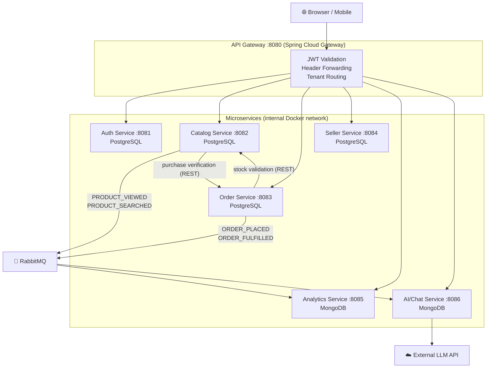

---

## 2. Class Diagrams

### 2.1 Auth Service

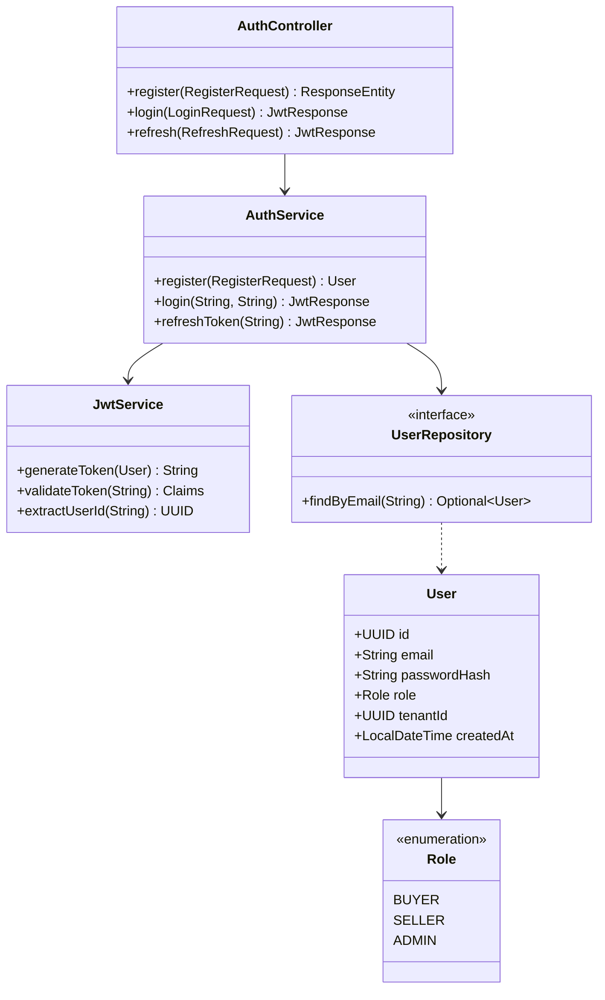

---

### 2.2 Catalog Service

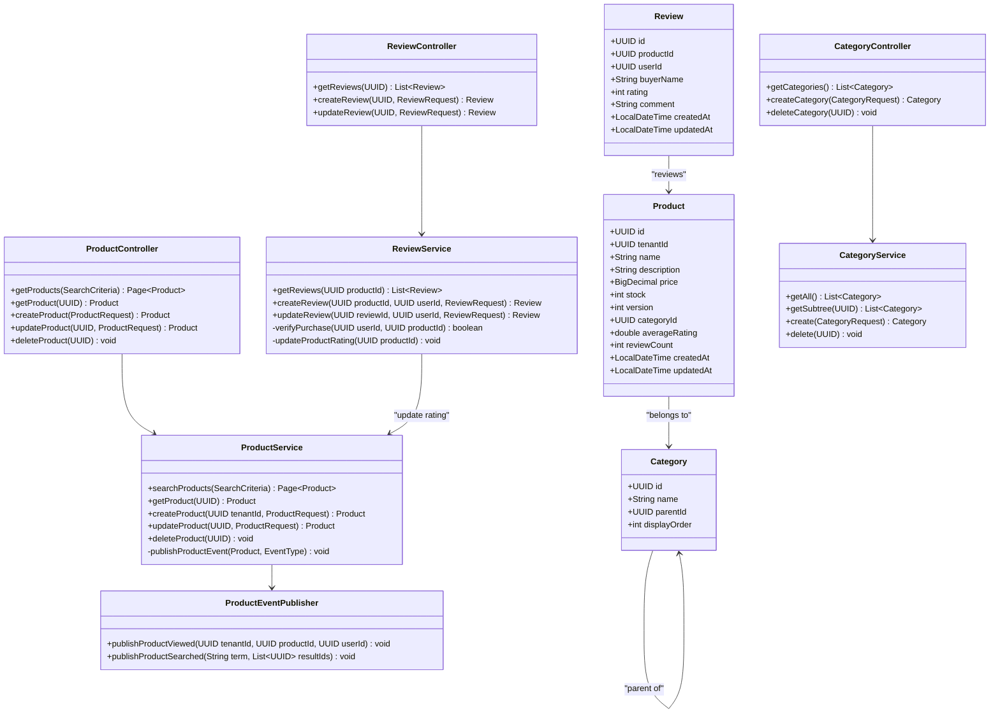

---

### 2.3 Order Service

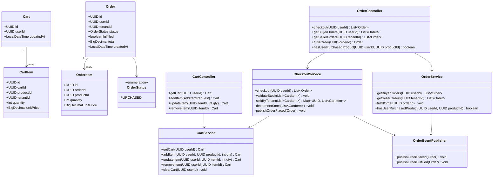

---

### 2.4 Seller Service

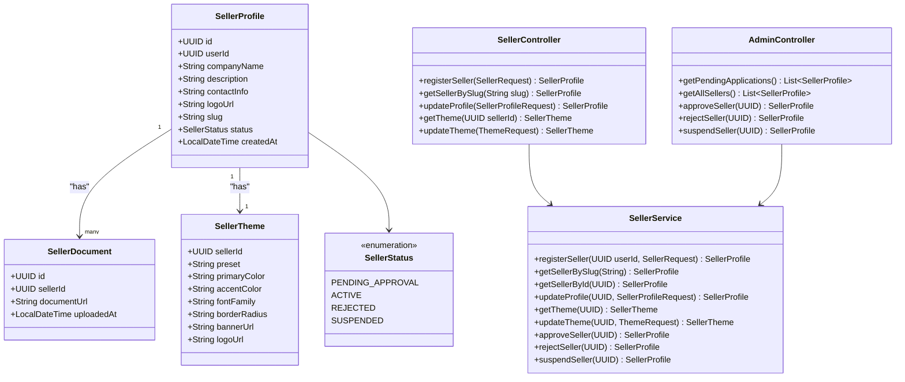

---

### 2.5 Analytics Service

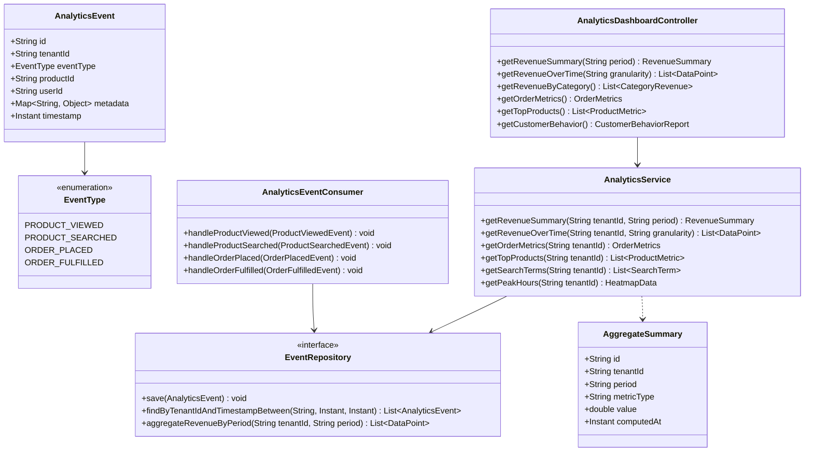

---

### 2.6 AI / Chat Service

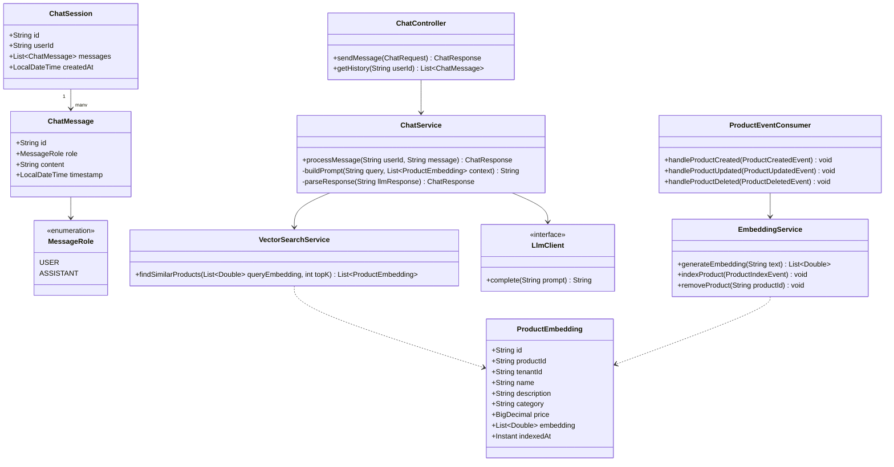

---

## 3. Database ER Diagrams

### 3.1 Auth Service DB

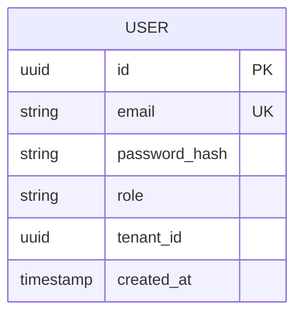

---

### 3.2 Catalog Service DB

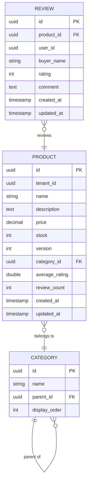

---

### 3.3 Order Service DB

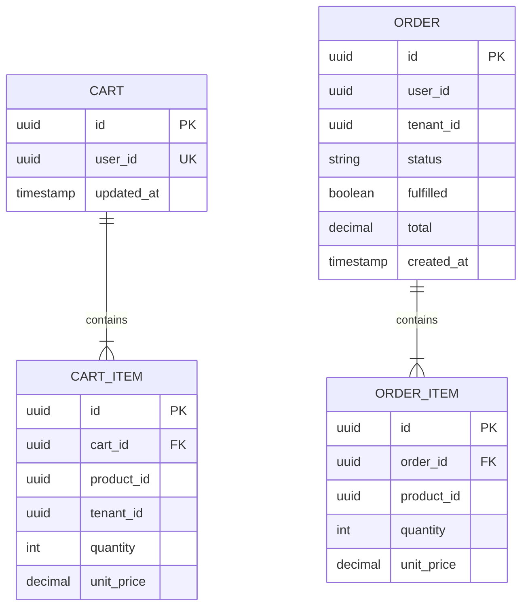

---

### 3.4 Seller Service DB

```mermaid
erDiagram
    SELLER_PROFILE {
        uuid id PK
        uuid user_id UK
        string company_name
        text description
        string contact_info
        string logo_url
        string slug UK
        string status
        timestamp created_at
    }

    SELLER_DOCUMENT {
        uuid id PK
        uuid seller_id FK
        string document_url
        timestamp uploaded_at
    }

    SELLER_THEME {
        uuid seller_id PK_FK
        string preset
        string primary_color
        string accent_color
        string font_family
        string border_radius
        string banner_url
        string logo_url
    }

    SELLER_PROFILE ||--|{ SELLER_DOCUMENT : "has"
    SELLER_PROFILE ||--|| SELLER_THEME : "has"
```

---

## 4. Sequence Diagrams

### 4.1 Checkout Flow

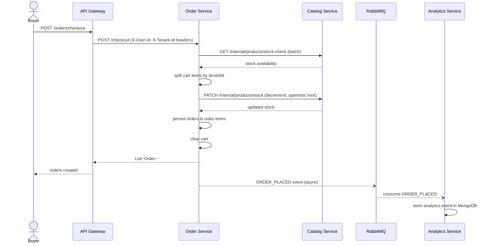

---

### 4.2 AI Chat Flow

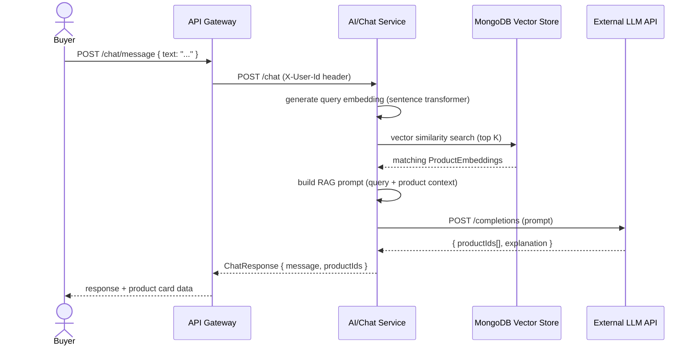

---

### 4.3 Product Indexing Flow

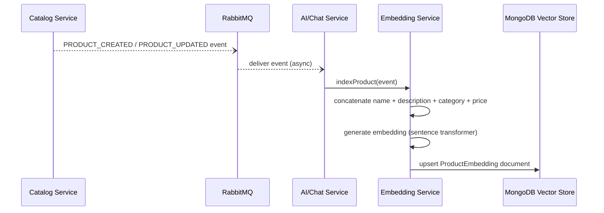

---

### 4.4 Seller Registration & Approval

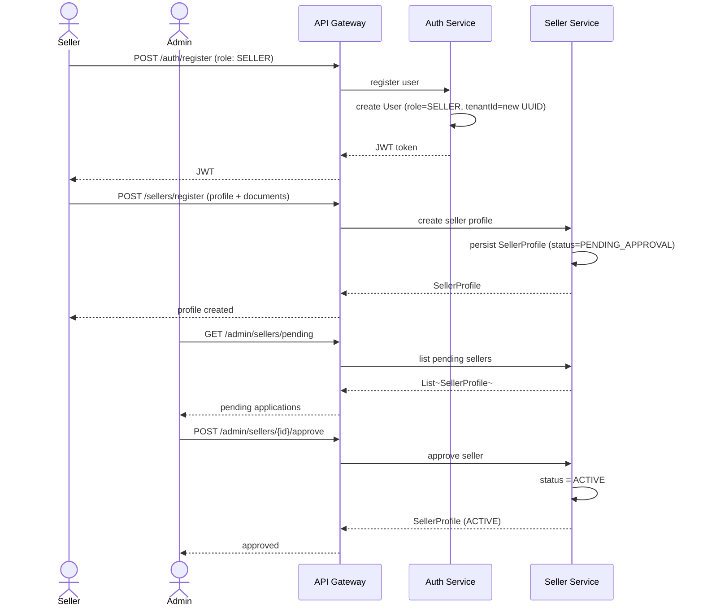
