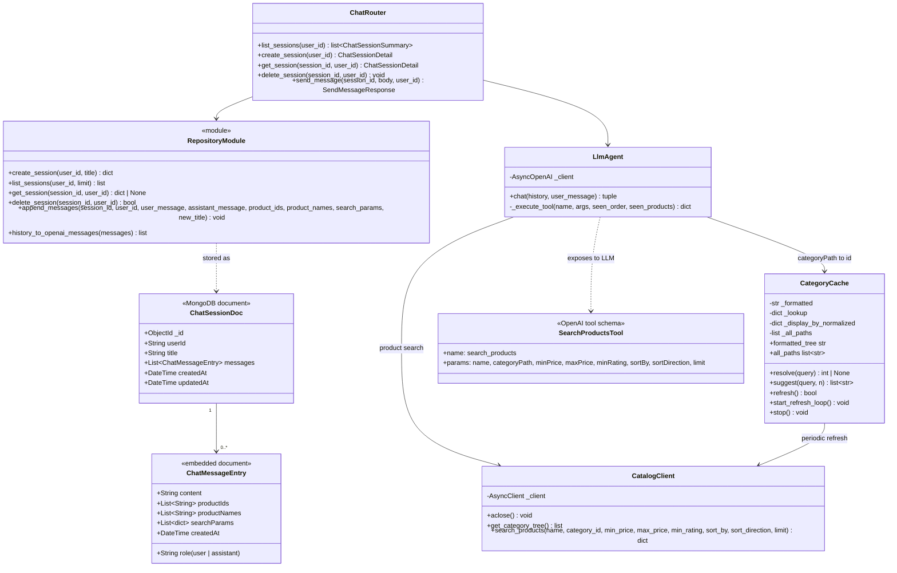

# AI / Chat Service — Module Diagram

The chat service is a Python / FastAPI application. It delegates product
lookup to the catalog service via REST and uses an external LLM's
tool-calling feature to drive the search loop.

## Notes

- **Search via catalog REST.** Product retrieval is delegated to the catalog
  service's existing search endpoint (`GET /api/categories` + `GET /api/products`).
- **LLM tool calling.** The LLM is given a `search_products` tool and chooses
  when to call it, with what parameters, and how many parallel calls to issue
  (one per category for multi-intent queries). On the first iteration
  `tool_choice="required"` forces the model to search before answering.
- **Three catalog calls per tool invocation.** For every `search_products`
  tool call the LLM makes, the service fans out into three catalog calls —
  `(name + category + filters)`, `(category + filters, no name)`, and
  `(name only)` — to widen the candidate pool before the LLM ranks.
- **Categories cached in-process.** `CategoryCache` pulls the tree from the
  catalog service on startup and refreshes periodically (configurable); it
  resolves the `categoryPath` the LLM passes (as a string) to an internal
  integer `categoryId`, with `difflib` fuzzy-match fallback for near misses.
- **LLM-as-reranker.** The final LLM turn returns a JSON object with a
  `_reasoning` field, a `message` field, and a `products` array of
  `{id, score}` pairs; the service filters by score threshold and returns the
  top N to the client.
- **Conversational memory.** Prior `searchParams` and `productNames` are
  appended to each stored assistant message as bracketed hints (via
  `history_to_openai_messages`), so the model can TUNE previous searches
  (adjusting price, sort, category) or REPLACE them when the user pivots.
- **Fallback responses.** If the LLM reaches `llm_max_iterations` without a
  final answer, or returns invalid JSON, the service returns a random
  user-friendly fallback message.
