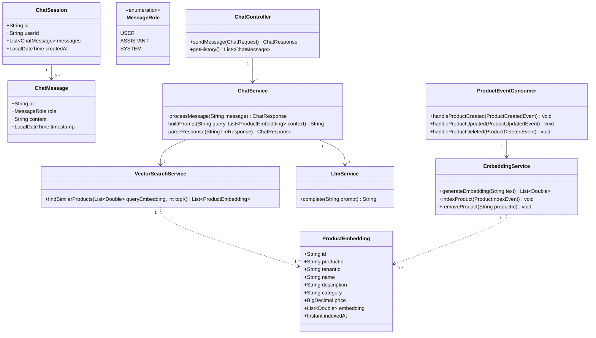

# AI / Chat Service — Class Diagram

```mermaid
classDiagram
    class ProductEmbedding {
        +String id
        +String productId
        +String tenantId
        +String name
        +String description
        +String category
        +BigDecimal price
        +List~Double~ embedding
        +Instant indexedAt
    }

    class ChatSession {
        +String id
        +String userId
        +List~ChatMessage~ messages
        +LocalDateTime createdAt
    }

    class ChatMessage {
        +String id
        +MessageRole role
        +String content
        +LocalDateTime timestamp
    }

    class MessageRole {
        <<enumeration>>
        USER
        ASSISTANT
        SYSTEM
    }

    class ChatController {
        +sendMessage(ChatRequest) ChatResponse
        +getHistory() List~ChatMessage~
    }

    class ChatService {
        +processMessage(String message) ChatResponse
        -buildPrompt(String query, List~ProductEmbedding~ context) String
        -parseResponse(String llmResponse) ChatResponse
    }

    class EmbeddingService {
        +generateEmbedding(String text) List~Double~
        +indexProduct(ProductIndexEvent) void
        +removeProduct(String productId) void
    }

    class VectorSearchService {
        +findSimilarProducts(List~Double~ queryEmbedding, int topK) List~ProductEmbedding~
    }

    class LlmService {
        +complete(String prompt) String
    }

    class ProductEventConsumer {
        +handleProductCreated(ProductCreatedEvent) void
        +handleProductUpdated(ProductUpdatedEvent) void
        +handleProductDeleted(ProductDeletedEvent) void
    }

    ChatSession "1" --> "0..*" ChatMessage
    ChatController "1" --> "1" ChatService
    ChatService "1" --> "1" VectorSearchService
    ChatService "1" --> "1" LlmService
    VectorSearchService "1" ..> "1..*" ProductEmbedding
    ProductEventConsumer "1" --> "1" EmbeddingService
    EmbeddingService "1" ..> "0..*" ProductEmbedding
```
