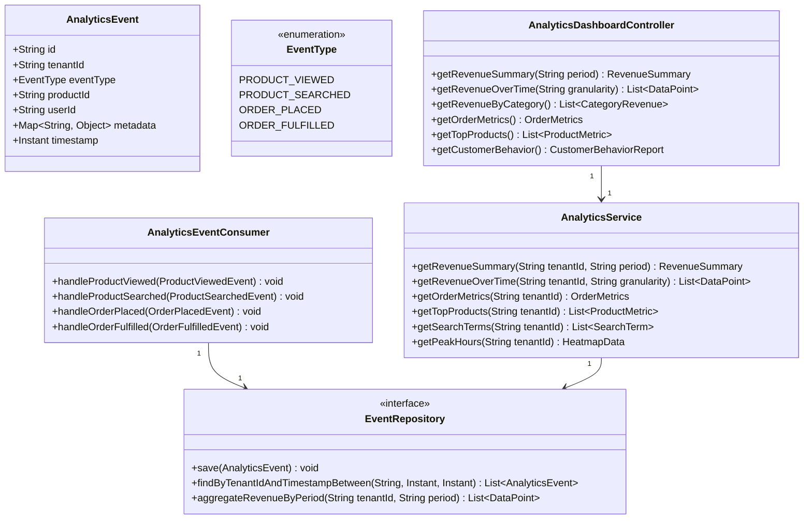

# Analytics Service — Class Diagram

```mermaid
classDiagram
    class AnalyticsEvent {
        +String id
        +String tenantId
        +EventType eventType
        +String productId
        +String userId
        +Map~String, Object~ metadata
        +Instant timestamp
    }

    class EventType {
        <<enumeration>>
        PRODUCT_VIEWED
        PRODUCT_SEARCHED
        ORDER_PLACED
        ORDER_FULFILLED
    }

    class AnalyticsEventConsumer {
        +handleProductViewed(ProductViewedEvent) void
        +handleProductSearched(ProductSearchedEvent) void
        +handleOrderPlaced(OrderPlacedEvent) void
        +handleOrderFulfilled(OrderFulfilledEvent) void
    }

    class AnalyticsDashboardController {
        +getRevenueSummary(String period) RevenueSummary
        +getRevenueOverTime(String granularity) List~DataPoint~
        +getRevenueByCategory() List~CategoryRevenue~
        +getOrderMetrics() OrderMetrics
        +getTopProducts() List~ProductMetric~
        +getCustomerBehavior() CustomerBehaviorReport
    }

    class AnalyticsService {
        +getRevenueSummary(String tenantId, String period) RevenueSummary
        +getRevenueOverTime(String tenantId, String granularity) List~DataPoint~
        +getOrderMetrics(String tenantId) OrderMetrics
        +getTopProducts(String tenantId) List~ProductMetric~
        +getSearchTerms(String tenantId) List~SearchTerm~
        +getPeakHours(String tenantId) HeatmapData
    }

    class EventRepository {
        <<interface>>
        +save(AnalyticsEvent) void
        +findByTenantIdAndTimestampBetween(String, Instant, Instant) List~AnalyticsEvent~
        +aggregateRevenueByPeriod(String tenantId, String period) List~DataPoint~
    }

    AnalyticsEventConsumer "1" --> "1" EventRepository
    AnalyticsDashboardController "1" --> "1" AnalyticsService
    AnalyticsService "1" --> "1" EventRepository
```
