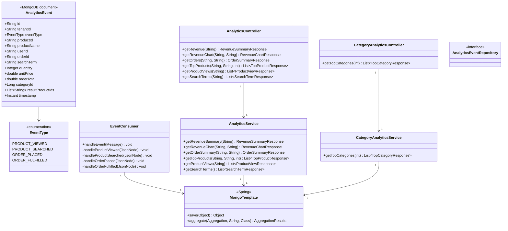

# Analytics Service — Class Diagram

```mermaid
classDiagram
    class AnalyticsEvent {
        <<MongoDB document>>
        +String id
        +String tenantId
        +EventType eventType
        +String productId
        +String productName
        +String userId
        +String orderId
        +String searchTerm
        +Integer quantity
        +double unitPrice
        +double orderTotal
        +Long categoryId
        +List~String~ resultProductIds
        +Instant timestamp
    }

    class EventType {
        <<enumeration>>
        PRODUCT_VIEWED
        PRODUCT_SEARCHED
        ORDER_PLACED
        ORDER_FULFILLED
    }

    class EventConsumer {
        +handleEvent(Message) void
        -handleProductViewed(JsonNode) void
        -handleProductSearched(JsonNode) void
        -handleOrderPlaced(JsonNode) void
        -handleOrderFulfilled(JsonNode) void
    }

    class AnalyticsController {
        +getRevenue(String) RevenueSummaryResponse
        +getRevenueChart(String, String) RevenueChartResponse
        +getOrders(String, String) OrderSummaryResponse
        +getTopProducts(String, String, int) List~TopProductResponse~
        +getProductViews(String) List~ProductViewResponse~
        +getSearchTerms(String) List~SearchTermResponse~
    }

    class CategoryAnalyticsController {
        +getTopCategories(int) List~TopCategoryResponse~
    }

    class AnalyticsService {
        +getRevenueSummary(String) RevenueSummaryResponse
        +getRevenueChart(String, String) RevenueChartResponse
        +getOrderSummary(String, String) OrderSummaryResponse
        +getTopProducts(String, String, int) List~TopProductResponse~
        +getProductViews(String) List~ProductViewResponse~
        +getSearchTerms() List~SearchTermResponse~
    }

    class CategoryAnalyticsService {
        +getTopCategories(int) List~TopCategoryResponse~
    }

    class AnalyticsEventRepository {
        <<interface>>
    }

    class MongoTemplate {
        <<Spring>>
        +save(Object) Object
        +aggregate(Aggregation, String, Class) AggregationResults
    }

    AnalyticsEvent --> EventType
    EventConsumer "1" --> "1" MongoTemplate
    AnalyticsController "1" --> "1" AnalyticsService
    CategoryAnalyticsController "1" --> "1" CategoryAnalyticsService
    AnalyticsService "1" --> "1" MongoTemplate
    CategoryAnalyticsService "1" --> "1" MongoTemplate
```
