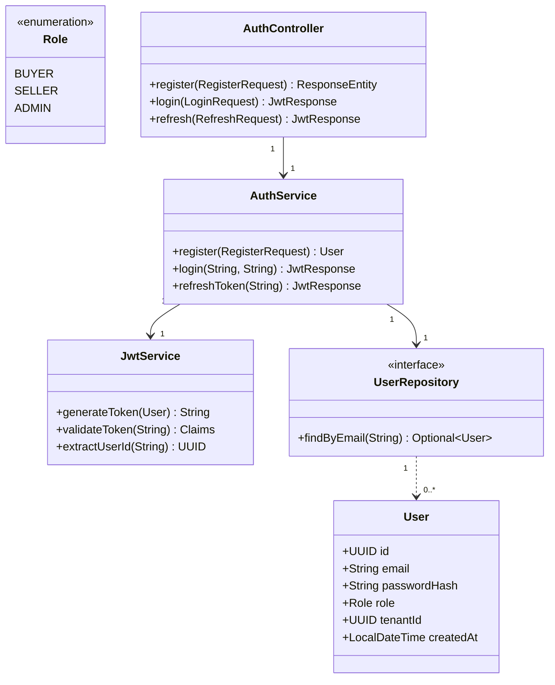

# Auth Service — Class Diagram

```mermaid
classDiagram
    class User {
        +UUID id
        +String email
        +String passwordHash
        +Role role
        +UUID tenantId
        +LocalDateTime createdAt
    }

    class Role {
        <<enumeration>>
        BUYER
        SELLER
        ADMIN
    }

    class AuthController {
        +register(RegisterRequest) ResponseEntity
        +login(LoginRequest) JwtResponse
        +refresh(RefreshRequest) JwtResponse
    }

    class AuthService {
        +register(RegisterRequest) User
        +login(String, String) JwtResponse
        +refreshToken(String) JwtResponse
    }

    class JwtService {
        +generateToken(User) String
        +validateToken(String) Claims
        +extractUserId(String) UUID
    }

    class UserRepository {
        <<interface>>
        +findByEmail(String) Optional~User~
    }

    AuthController "1" --> "1" AuthService
    AuthService "1" --> "1" JwtService
    AuthService "1" --> "1" UserRepository
    UserRepository "1" ..> "0..*" User
```
