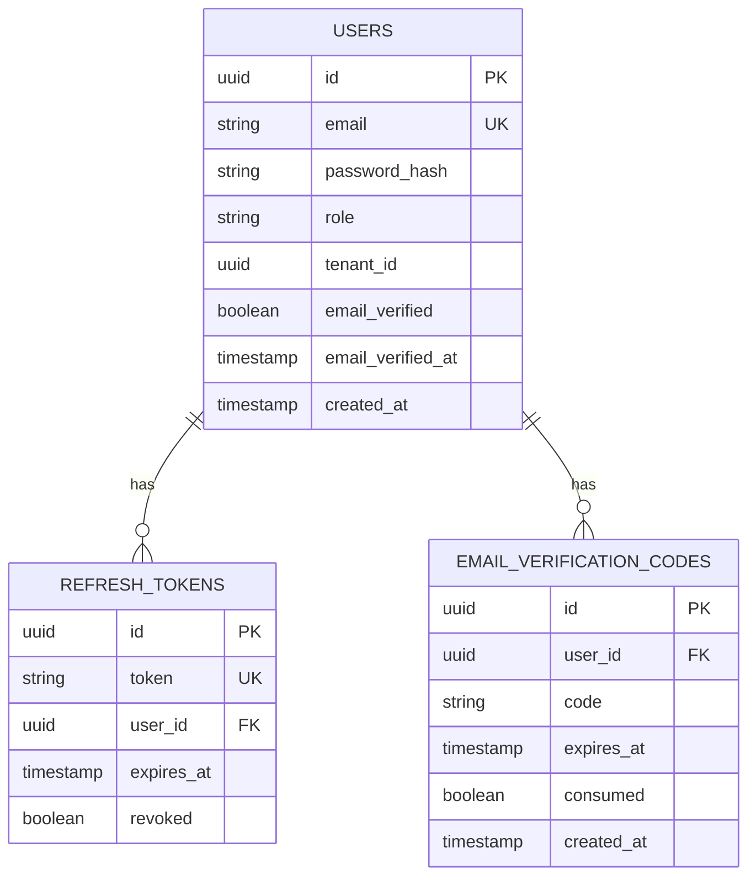

# Auth Service — ER Diagram

```mermaid
erDiagram
    USERS {
        uuid id PK
        string email UK
        string password_hash
        string role
        uuid tenant_id
        boolean email_verified
        timestamp email_verified_at
        timestamp created_at
    }

    REFRESH_TOKENS {
        uuid id PK
        string token UK
        uuid user_id FK
        timestamp expires_at
        boolean revoked
    }

    EMAIL_VERIFICATION_CODES {
        uuid id PK
        uuid user_id FK
        string code
        timestamp expires_at
        boolean consumed
        timestamp created_at
    }

    USERS ||--o{ REFRESH_TOKENS : "has"
    USERS ||--o{ EMAIL_VERIFICATION_CODES : "has"
```
