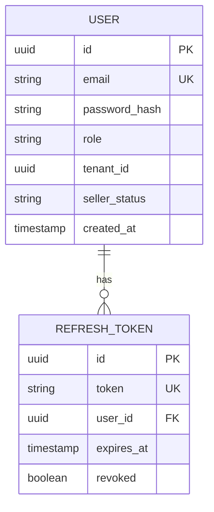

# Auth Service — ER Diagram

```mermaid
erDiagram
    USER {
        uuid id PK
        string email UK
        string password_hash
        string role
        uuid tenant_id
        string seller_status
        timestamp created_at
    }

    REFRESH_TOKEN {
        uuid id PK
        string token UK
        uuid user_id FK
        timestamp expires_at
        boolean revoked
    }

    USER ||--o{ REFRESH_TOKEN : "has"
```
