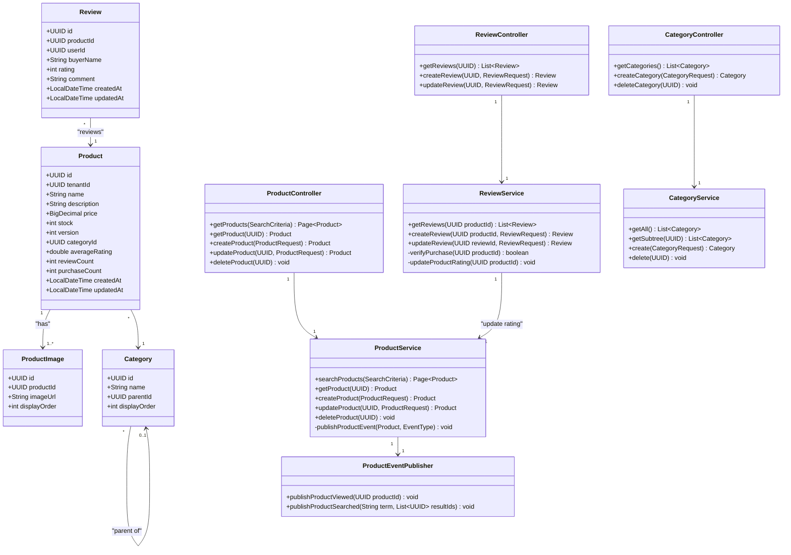

# Catalog Service — Class Diagram

```mermaid
classDiagram
    class Product {
        +UUID id
        +UUID tenantId
        +String name
        +String description
        +BigDecimal price
        +int stock
        +int version
        +UUID categoryId
        +double averageRating
        +int reviewCount
        +int purchaseCount
        +LocalDateTime createdAt
        +LocalDateTime updatedAt
    }

    class ProductImage {
        +UUID id
        +UUID productId
        +String imageUrl
        +int displayOrder
    }

    class Category {
        +UUID id
        +String name
        +UUID parentId
        +int displayOrder
    }

    class Review {
        +UUID id
        +UUID productId
        +UUID userId
        +String buyerName
        +int rating
        +String comment
        +LocalDateTime createdAt
        +LocalDateTime updatedAt
    }

    class ProductController {
        +getProducts(SearchCriteria) Page~Product~
        +getProduct(UUID) Product
        +createProduct(ProductRequest) Product
        +updateProduct(UUID, ProductRequest) Product
        +deleteProduct(UUID) void
    }

    class ReviewController {
        +getReviews(UUID) List~Review~
        +createReview(UUID, ReviewRequest) Review
        +updateReview(UUID, ReviewRequest) Review
    }

    class CategoryController {
        +getCategories() List~Category~
        +createCategory(CategoryRequest) Category
        +deleteCategory(UUID) void
    }

    class ProductService {
        +searchProducts(SearchCriteria) Page~Product~
        +getProduct(UUID) Product
        +createProduct(ProductRequest) Product
        +updateProduct(UUID, ProductRequest) Product
        +deleteProduct(UUID) void
        -publishProductEvent(Product, EventType) void
    }

    class ReviewService {
        +getReviews(UUID productId) List~Review~
        +createReview(UUID productId, ReviewRequest) Review
        +updateReview(UUID reviewId, ReviewRequest) Review
        -verifyPurchase(UUID productId) boolean
        -updateProductRating(UUID productId) void
    }

    class CategoryService {
        +getAll() List~Category~
        +getSubtree(UUID) List~Category~
        +create(CategoryRequest) Category
        +delete(UUID) void
    }

    class ProductEventPublisher {
        +publishProductViewed(UUID productId) void
        +publishProductSearched(String term, List~UUID~ resultIds) void
    }

    Product "1" --> "1..*" ProductImage : "has"
    Product "*" --> "1" Category
    Review "*" --> "1" Product : "reviews"
    Category "*" --> "0..1" Category : "parent of"
    ProductController "1" --> "1" ProductService
    ReviewController "1" --> "1" ReviewService
    CategoryController "1" --> "1" CategoryService
    ProductService "1" --> "1" ProductEventPublisher
    ReviewService "1" --> "1" ProductService : "update rating"
```
