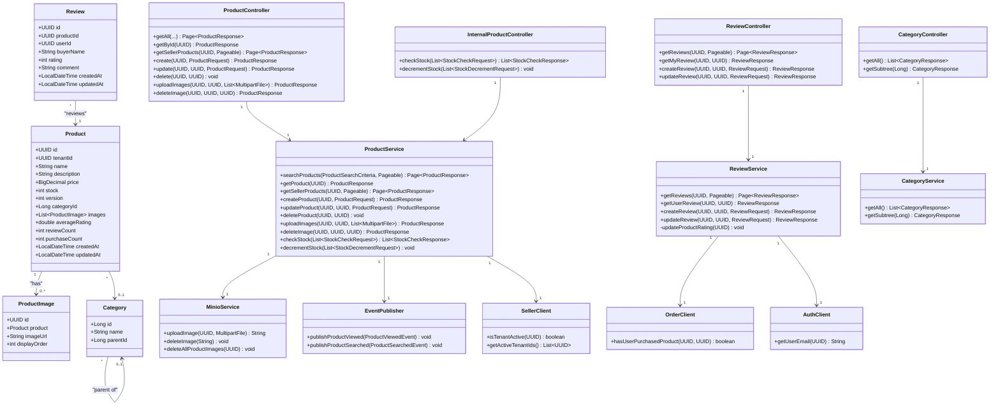

# Catalog Service — Class Diagram

```mermaid
classDiagram
    class Product {
        +UUID id
        +UUID tenantId
        +String name
        +String description
        +BigDecimal price
        +int stock
        +int version
        +Long categoryId
        +List~ProductImage~ images
        +double averageRating
        +int reviewCount
        +int purchaseCount
        +LocalDateTime createdAt
        +LocalDateTime updatedAt
    }

    class ProductImage {
        +UUID id
        +Product product
        +String imageUrl
        +int displayOrder
    }

    class Category {
        +Long id
        +String name
        +Long parentId
    }

    class Review {
        +UUID id
        +UUID productId
        +UUID userId
        +String buyerName
        +int rating
        +String comment
        +LocalDateTime createdAt
        +LocalDateTime updatedAt
    }

    class ProductController {
        +getAll(...) Page~ProductResponse~
        +getById(UUID) ProductResponse
        +getSellerProducts(UUID, Pageable) Page~ProductResponse~
        +create(UUID, ProductRequest) ProductResponse
        +update(UUID, UUID, ProductRequest) ProductResponse
        +delete(UUID, UUID) void
        +uploadImages(UUID, UUID, List~MultipartFile~) ProductResponse
        +deleteImage(UUID, UUID, UUID) ProductResponse
    }

    class ReviewController {
        +getReviews(UUID, Pageable) Page~ReviewResponse~
        +getMyReview(UUID, UUID) ReviewResponse
        +createReview(UUID, UUID, ReviewRequest) ReviewResponse
        +updateReview(UUID, UUID, ReviewRequest) ReviewResponse
    }

    class CategoryController {
        +getAll() List~CategoryResponse~
        +getSubtree(Long) CategoryResponse
    }

    class InternalProductController {
        +checkStock(List~StockCheckRequest~) List~StockCheckResponse~
        +decrementStock(List~StockDecrementRequest~) void
    }

    class ProductService {
        +searchProducts(ProductSearchCriteria, Pageable) Page~ProductResponse~
        +getProduct(UUID) ProductResponse
        +getSellerProducts(UUID, Pageable) Page~ProductResponse~
        +createProduct(UUID, ProductRequest) ProductResponse
        +updateProduct(UUID, UUID, ProductRequest) ProductResponse
        +deleteProduct(UUID, UUID) void
        +uploadImages(UUID, UUID, List~MultipartFile~) ProductResponse
        +deleteImage(UUID, UUID, UUID) ProductResponse
        +checkStock(List~StockCheckRequest~) List~StockCheckResponse~
        +decrementStock(List~StockDecrementRequest~) void
    }

    class ReviewService {
        +getReviews(UUID, Pageable) Page~ReviewResponse~
        +getUserReview(UUID, UUID) ReviewResponse
        +createReview(UUID, UUID, ReviewRequest) ReviewResponse
        +updateReview(UUID, UUID, ReviewRequest) ReviewResponse
        -updateProductRating(UUID) void
    }

    class CategoryService {
        +getAll() List~CategoryResponse~
        +getSubtree(Long) CategoryResponse
    }

    class MinioService {
        +uploadImage(UUID, MultipartFile) String
        +deleteImage(String) void
        +deleteAllProductImages(UUID) void
    }

    class EventPublisher {
        +publishProductViewed(ProductViewedEvent) void
        +publishProductSearched(ProductSearchedEvent) void
    }

    class OrderClient {
        +hasUserPurchasedProduct(UUID, UUID) boolean
    }

    class AuthClient {
        +getUserEmail(UUID) String
    }

    class SellerClient {
        +isTenantActive(UUID) boolean
        +getActiveTenantIds() List~UUID~
    }

    Product "1" --> "0..*" ProductImage : "has"
    Product "*" --> "0..1" Category
    Review "*" --> "1" Product : "reviews"
    Category "*" --> "0..1" Category : "parent of"

    ProductController "1" --> "1" ProductService
    ReviewController "1" --> "1" ReviewService
    CategoryController "1" --> "1" CategoryService
    InternalProductController "1" --> "1" ProductService

    ProductService "1" --> "1" MinioService
    ProductService "1" --> "1" EventPublisher
    ProductService "1" --> "1" SellerClient
    ReviewService "1" --> "1" OrderClient
    ReviewService "1" --> "1" AuthClient
```
