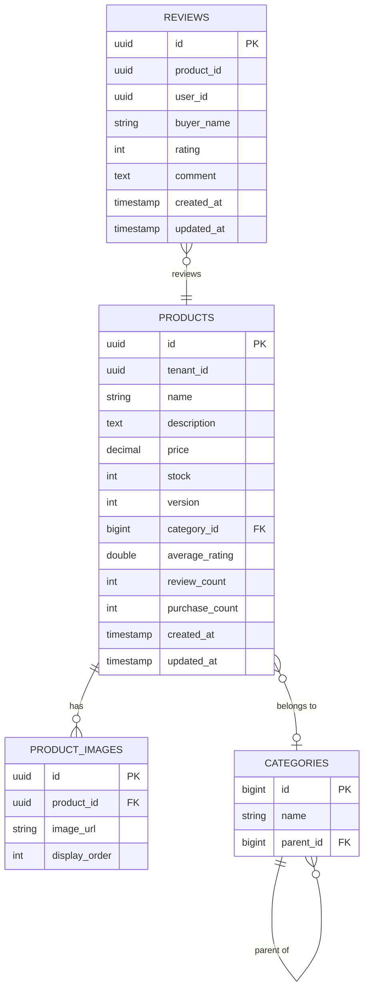

# Catalog Service — ER Diagram

```mermaid
erDiagram
    PRODUCTS {
        uuid id PK
        uuid tenant_id
        string name
        text description
        decimal price
        int stock
        int version
        bigint category_id FK
        double average_rating
        int review_count
        int purchase_count
        timestamp created_at
        timestamp updated_at
    }

    PRODUCT_IMAGES {
        uuid id PK
        uuid product_id FK
        string image_url
        int display_order
    }

    CATEGORIES {
        bigint id PK
        string name
        bigint parent_id FK
    }

    REVIEWS {
        uuid id PK
        uuid product_id
        uuid user_id
        string buyer_name
        int rating
        text comment
        timestamp created_at
        timestamp updated_at
    }

    PRODUCTS }o--o| CATEGORIES : "belongs to"
    PRODUCTS ||--o{ PRODUCT_IMAGES : "has"
    REVIEWS }o--|| PRODUCTS : "reviews"
    CATEGORIES ||--o{ CATEGORIES : "parent of"
```
