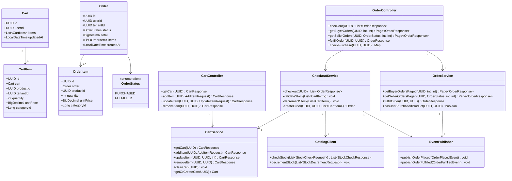

# Order Service — Class Diagram

```mermaid
classDiagram
    class Cart {
        +UUID id
        +UUID userId
        +List~CartItem~ items
        +LocalDateTime updatedAt
    }

    class CartItem {
        +UUID id
        +Cart cart
        +UUID productId
        +UUID tenantId
        +int quantity
        +BigDecimal unitPrice
        +Long categoryId
    }

    class Order {
        +UUID id
        +UUID userId
        +UUID tenantId
        +OrderStatus status
        +BigDecimal total
        +List~OrderItem~ items
        +LocalDateTime createdAt
    }

    class OrderItem {
        +UUID id
        +Order order
        +UUID productId
        +int quantity
        +BigDecimal unitPrice
        +Long categoryId
    }

    class OrderStatus {
        <<enumeration>>
        PURCHASED
        FULFILLED
    }

    class CartController {
        +getCart(UUID) CartResponse
        +addItem(UUID, AddItemRequest) CartResponse
        +updateItem(UUID, UUID, UpdateItemRequest) CartResponse
        +removeItem(UUID, UUID) CartResponse
    }

    class OrderController {
        +checkout(UUID) List~OrderResponse~
        +getBuyerOrders(UUID, int, int) Page~OrderResponse~
        +getSellerOrders(UUID, OrderStatus, int, int) Page~OrderResponse~
        +fulfillOrder(UUID, UUID) OrderResponse
        +checkPurchase(UUID, UUID) Map
    }

    class CartService {
        +getCart(UUID) CartResponse
        +addItem(UUID, AddItemRequest) CartResponse
        +updateItem(UUID, UUID, int) CartResponse
        +removeItem(UUID, UUID) CartResponse
        +clearCart(UUID) void
        ~getOrCreateCart(UUID) Cart
    }

    class CheckoutService {
        +checkout(UUID) List~OrderResponse~
        -validateStock(List~CartItem~) void
        -decrementStock(List~CartItem~) void
        -createOrder(UUID, UUID, List~CartItem~) Order
    }

    class OrderService {
        +getBuyerOrdersPaged(UUID, int, int) Page~OrderResponse~
        +getSellerOrdersPaged(UUID, OrderStatus, int, int) Page~OrderResponse~
        +fulfillOrder(UUID, UUID) OrderResponse
        +hasUserPurchasedProduct(UUID, UUID) boolean
    }

    class EventPublisher {
        +publishOrderPlaced(OrderPlacedEvent) void
        +publishOrderFulfilled(OrderFulfilledEvent) void
    }

    class CatalogClient {
        +checkStock(List~StockCheckRequest~) List~StockCheckResponse~
        +decrementStock(List~StockDecrementRequest~) void
    }

    Cart "1" --> "0..*" CartItem
    Order "1" --> "1..*" OrderItem
    Order --> OrderStatus

    CartController "1" --> "1" CartService
    OrderController "1" --> "1" CheckoutService
    OrderController "1" --> "1" OrderService
    CheckoutService "1" --> "1" CartService
    CheckoutService "1" --> "1" CatalogClient
    CheckoutService "1" --> "1" EventPublisher
    OrderService "1" --> "1" EventPublisher
```
