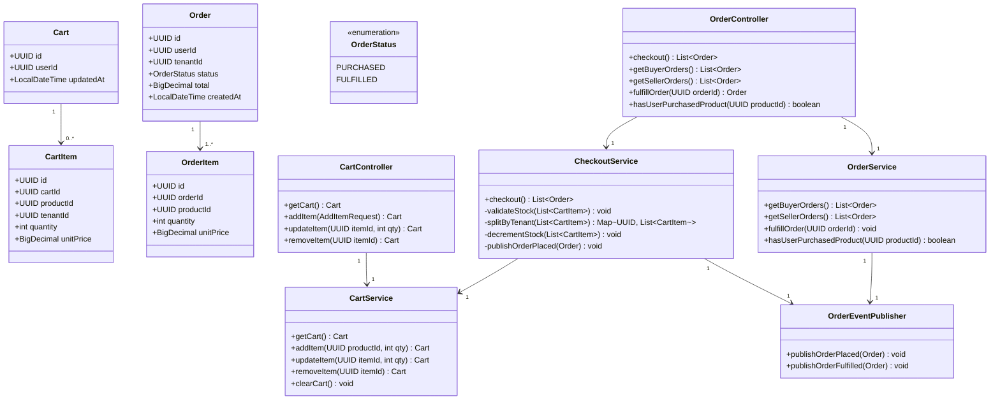

# Order Service — Class Diagram

```mermaid
classDiagram
    class Cart {
        +UUID id
        +UUID userId
        +LocalDateTime updatedAt
    }

    class CartItem {
        +UUID id
        +UUID cartId
        +UUID productId
        +UUID tenantId
        +int quantity
        +BigDecimal unitPrice
    }

    class Order {
        +UUID id
        +UUID userId
        +UUID tenantId
        +OrderStatus status
        +BigDecimal total
        +LocalDateTime createdAt
    }

    class OrderItem {
        +UUID id
        +UUID orderId
        +UUID productId
        +int quantity
        +BigDecimal unitPrice
    }

    class OrderStatus {
        <<enumeration>>
        PURCHASED
        FULFILLED
    }

    class CartController {
        +getCart() Cart
        +addItem(AddItemRequest) Cart
        +updateItem(UUID itemId, int qty) Cart
        +removeItem(UUID itemId) Cart
    }

    class OrderController {
        +checkout() List~Order~
        +getBuyerOrders() List~Order~
        +getSellerOrders() List~Order~
        +fulfillOrder(UUID orderId) Order
        +hasUserPurchasedProduct(UUID productId) boolean
    }

    class CartService {
        +getCart() Cart
        +addItem(UUID productId, int qty) Cart
        +updateItem(UUID itemId, int qty) Cart
        +removeItem(UUID itemId) Cart
        +clearCart() void
    }

    class CheckoutService {
        +checkout() List~Order~
        -validateStock(List~CartItem~) void
        -splitByTenant(List~CartItem~) Map~UUID, List~CartItem~~
        -decrementStock(List~CartItem~) void
        -publishOrderPlaced(Order) void
    }

    class OrderService {
        +getBuyerOrders() List~Order~
        +getSellerOrders() List~Order~
        +fulfillOrder(UUID orderId) void
        +hasUserPurchasedProduct(UUID productId) boolean
    }

    class OrderEventPublisher {
        +publishOrderPlaced(Order) void
        +publishOrderFulfilled(Order) void
    }

    Cart "1" --> "0..*" CartItem
    Order "1" --> "1..*" OrderItem
    CartController "1" --> "1" CartService
    OrderController "1" --> "1" CheckoutService
    OrderController "1" --> "1" OrderService
    CheckoutService "1" --> "1" CartService
    CheckoutService "1" --> "1" OrderEventPublisher
    OrderService "1" --> "1" OrderEventPublisher
```
