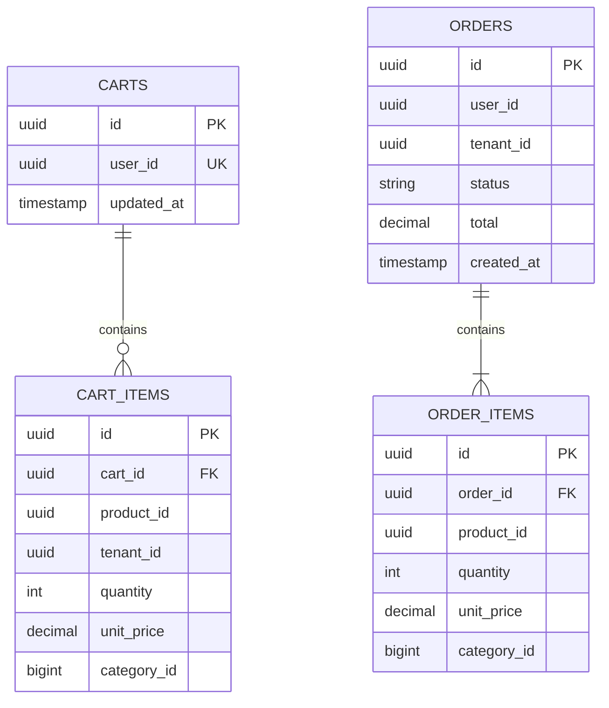

# Order Service — ER Diagram

```mermaid
erDiagram
    CARTS {
        uuid id PK
        uuid user_id UK
        timestamp updated_at
    }

    CART_ITEMS {
        uuid id PK
        uuid cart_id FK
        uuid product_id
        uuid tenant_id
        int quantity
        decimal unit_price
        bigint category_id
    }

    ORDERS {
        uuid id PK
        uuid user_id
        uuid tenant_id
        string status
        decimal total
        timestamp created_at
    }

    ORDER_ITEMS {
        uuid id PK
        uuid order_id FK
        uuid product_id
        int quantity
        decimal unit_price
        bigint category_id
    }

    CARTS ||--o{ CART_ITEMS : "contains"
    ORDERS ||--|{ ORDER_ITEMS : "contains"
```
