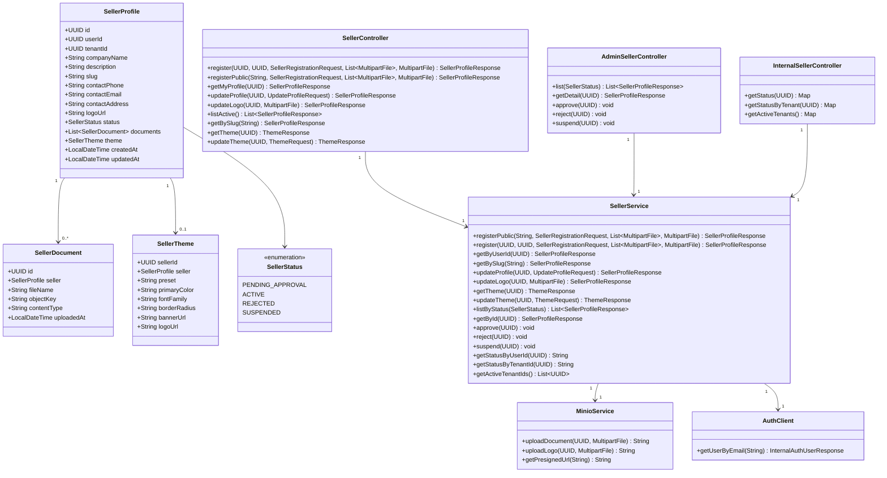

# Seller Service — Class Diagram

```mermaid
classDiagram
    class SellerProfile {
        +UUID id
        +UUID userId
        +UUID tenantId
        +String companyName
        +String description
        +String slug
        +String contactPhone
        +String contactEmail
        +String contactAddress
        +String logoUrl
        +SellerStatus status
        +List~SellerDocument~ documents
        +SellerTheme theme
        +LocalDateTime createdAt
        +LocalDateTime updatedAt
    }

    class SellerDocument {
        +UUID id
        +SellerProfile seller
        +String fileName
        +String objectKey
        +String contentType
        +LocalDateTime uploadedAt
    }

    class SellerTheme {
        +UUID sellerId
        +SellerProfile seller
        +String preset
        +String primaryColor
        +String fontFamily
        +String borderRadius
        +String bannerUrl
        +String logoUrl
    }

    class SellerStatus {
        <<enumeration>>
        PENDING_APPROVAL
        ACTIVE
        REJECTED
        SUSPENDED
    }

    class SellerController {
        +register(UUID, UUID, SellerRegistrationRequest, List~MultipartFile~, MultipartFile) SellerProfileResponse
        +registerPublic(String, SellerRegistrationRequest, List~MultipartFile~, MultipartFile) SellerProfileResponse
        +getMyProfile(UUID) SellerProfileResponse
        +updateProfile(UUID, UpdateProfileRequest) SellerProfileResponse
        +updateLogo(UUID, MultipartFile) SellerProfileResponse
        +listActive() List~SellerProfileResponse~
        +getBySlug(String) SellerProfileResponse
        +getTheme(UUID) ThemeResponse
        +updateTheme(UUID, ThemeRequest) ThemeResponse
    }

    class AdminSellerController {
        +list(SellerStatus) List~SellerProfileResponse~
        +getDetail(UUID) SellerProfileResponse
        +approve(UUID) void
        +reject(UUID) void
        +suspend(UUID) void
    }

    class InternalSellerController {
        +getStatus(UUID) Map
        +getStatusByTenant(UUID) Map
        +getActiveTenants() Map
    }

    class SellerService {
        +registerPublic(String, SellerRegistrationRequest, List~MultipartFile~, MultipartFile) SellerProfileResponse
        +register(UUID, UUID, SellerRegistrationRequest, List~MultipartFile~, MultipartFile) SellerProfileResponse
        +getByUserId(UUID) SellerProfileResponse
        +getBySlug(String) SellerProfileResponse
        +updateProfile(UUID, UpdateProfileRequest) SellerProfileResponse
        +updateLogo(UUID, MultipartFile) SellerProfileResponse
        +getTheme(UUID) ThemeResponse
        +updateTheme(UUID, ThemeRequest) ThemeResponse
        +listByStatus(SellerStatus) List~SellerProfileResponse~
        +getById(UUID) SellerProfileResponse
        +approve(UUID) void
        +reject(UUID) void
        +suspend(UUID) void
        +getStatusByUserId(UUID) String
        +getStatusByTenantId(UUID) String
        +getActiveTenantIds() List~UUID~
    }

    class MinioService {
        +uploadDocument(UUID, MultipartFile) String
        +uploadLogo(UUID, MultipartFile) String
        +getPresignedUrl(String) String
    }

    class AuthClient {
        +getUserByEmail(String) InternalAuthUserResponse
    }

    SellerProfile "1" --> "0..*" SellerDocument
    SellerProfile "1" --> "0..1" SellerTheme
    SellerProfile --> SellerStatus
    SellerController "1" --> "1" SellerService
    AdminSellerController "1" --> "1" SellerService
    InternalSellerController "1" --> "1" SellerService
    SellerService "1" --> "1" MinioService
    SellerService "1" --> "1" AuthClient
```
