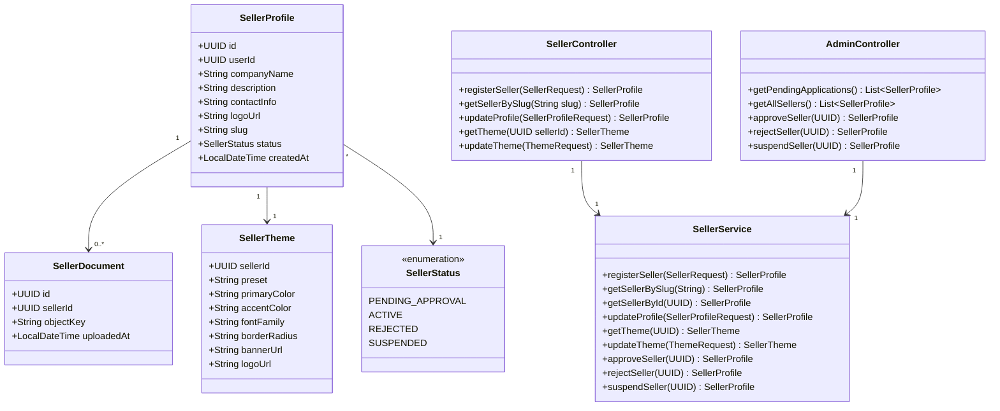

# Seller Service — Class Diagram

```mermaid
classDiagram
    class SellerProfile {
        +UUID id
        +UUID userId
        +String companyName
        +String description
        +String contactInfo
        +String logoUrl
        +String slug
        +SellerStatus status
        +LocalDateTime createdAt
    }

    class SellerDocument {
        +UUID id
        +UUID sellerId
        +String objectKey
        +LocalDateTime uploadedAt
    }

    class SellerTheme {
        +UUID sellerId
        +String preset
        +String primaryColor
        +String accentColor
        +String fontFamily
        +String borderRadius
        +String bannerUrl
        +String logoUrl
    }

    class SellerStatus {
        <<enumeration>>
        PENDING_APPROVAL
        ACTIVE
        REJECTED
        SUSPENDED
    }

    class SellerController {
        +registerSeller(SellerRequest) SellerProfile
        +getSellerBySlug(String slug) SellerProfile
        +updateProfile(SellerProfileRequest) SellerProfile
        +getTheme(UUID sellerId) SellerTheme
        +updateTheme(ThemeRequest) SellerTheme
    }

    class AdminController {
        +getPendingApplications() List~SellerProfile~
        +getAllSellers() List~SellerProfile~
        +approveSeller(UUID) SellerProfile
        +rejectSeller(UUID) SellerProfile
        +suspendSeller(UUID) SellerProfile
    }

    class SellerService {
        +registerSeller(SellerRequest) SellerProfile
        +getSellerBySlug(String) SellerProfile
        +getSellerById(UUID) SellerProfile
        +updateProfile(SellerProfileRequest) SellerProfile
        +getTheme(UUID) SellerTheme
        +updateTheme(ThemeRequest) SellerTheme
        +approveSeller(UUID) SellerProfile
        +rejectSeller(UUID) SellerProfile
        +suspendSeller(UUID) SellerProfile
    }

    SellerProfile "1" --> "0..*" SellerDocument
    SellerProfile "1" --> "1" SellerTheme
    SellerProfile "*" --> "1" SellerStatus
    SellerController "1" --> "1" SellerService
    AdminController "1" --> "1" SellerService
```
