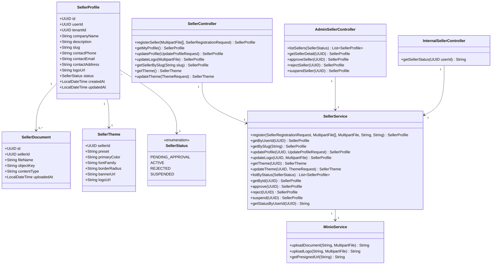

# Seller Service — Class Diagram

```mermaid
classDiagram
    class SellerProfile {
        +UUID id
        +UUID userId
        +UUID tenantId
        +String companyName
        +String description
        +String slug
        +String contactPhone
        +String contactEmail
        +String contactAddress
        +String logoUrl
        +SellerStatus status
        +LocalDateTime createdAt
        +LocalDateTime updatedAt
    }

    class SellerDocument {
        +UUID id
        +UUID sellerId
        +String fileName
        +String objectKey
        +String contentType
        +LocalDateTime uploadedAt
    }

    class SellerTheme {
        +UUID sellerId
        +String preset
        +String primaryColor
        +String fontFamily
        +String borderRadius
        +String bannerUrl
        +String logoUrl
    }

    class SellerStatus {
        <<enumeration>>
        PENDING_APPROVAL
        ACTIVE
        REJECTED
        SUSPENDED
    }

    class SellerController {
        +registerSeller(MultipartFile[], SellerRegistrationRequest) SellerProfile
        +getMyProfile() SellerProfile
        +updateProfile(UpdateProfileRequest) SellerProfile
        +updateLogo(MultipartFile) SellerProfile
        +getSellerBySlug(String slug) SellerProfile
        +getTheme() SellerTheme
        +updateTheme(ThemeRequest) SellerTheme
    }

    class AdminSellerController {
        +listSellers(SellerStatus) List~SellerProfile~
        +getSellerDetail(UUID) SellerProfile
        +approveSeller(UUID) SellerProfile
        +rejectSeller(UUID) SellerProfile
        +suspendSeller(UUID) SellerProfile
    }

    class InternalSellerController {
        +getSellerStatus(UUID userId) String
    }

    class SellerService {
        +register(SellerRegistrationRequest, MultipartFile[], MultipartFile, String, String) SellerProfile
        +getByUserId(UUID) SellerProfile
        +getBySlug(String) SellerProfile
        +updateProfile(UUID, UpdateProfileRequest) SellerProfile
        +updateLogo(UUID, MultipartFile) SellerProfile
        +getTheme(UUID) SellerTheme
        +updateTheme(UUID, ThemeRequest) SellerTheme
        +listByStatus(SellerStatus) List~SellerProfile~
        +getById(UUID) SellerProfile
        +approve(UUID) SellerProfile
        +reject(UUID) SellerProfile
        +suspend(UUID) SellerProfile
        +getStatusByUserId(UUID) String
    }

    class MinioService {
        +uploadDocument(String, MultipartFile) String
        +uploadLogo(String, MultipartFile) String
        +getPresignedUrl(String) String
    }

    SellerProfile "1" --> "0..*" SellerDocument
    SellerProfile "1" --> "1" SellerTheme
    SellerProfile "*" --> "1" SellerStatus
    SellerController "1" --> "1" SellerService
    AdminSellerController "1" --> "1" SellerService
    InternalSellerController "1" --> "1" SellerService
    SellerService "1" --> "1" MinioService
```
