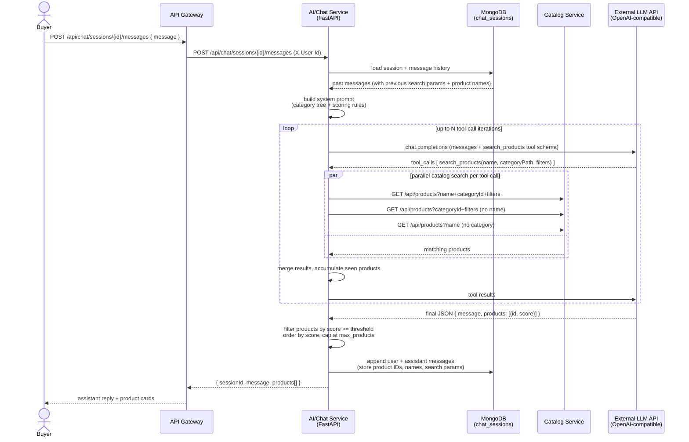

# Sequence Diagram — AI Chat Flow

```mermaid
sequenceDiagram
    actor Buyer
    participant GW as API Gateway
    participant AI as AI/Chat Service<br/>(FastAPI)
    participant DB as MongoDB<br/>(chat_sessions)
    participant CAT as Catalog Service
    participant LLM as External LLM API<br/>(OpenAI-compatible)

    Buyer->>GW: POST /api/chat/sessions/{id}/messages { message }
    GW->>AI: POST /api/chat/sessions/{id}/messages (X-User-Id)

    AI->>DB: load session + message history
    DB-->>AI: past messages (with previous search params + product names)

    AI->>AI: build system prompt<br/>(category tree + scoring rules)

    loop up to N tool-call iterations
        AI->>LLM: chat.completions (messages + search_products tool schema)
        LLM-->>AI: tool_calls [ search_products(name, categoryPath, filters) ]

        par parallel catalog search per tool call
            AI->>CAT: GET /api/products?name+categoryId+filters
            AI->>CAT: GET /api/products?categoryId+filters (no name)
            AI->>CAT: GET /api/products?name (no category)
        and
            CAT-->>AI: matching products
        end

        AI->>AI: merge results, accumulate seen products
        AI->>LLM: tool results
    end

    LLM-->>AI: final JSON { message, products: [{id, score}] }
    AI->>AI: filter products by score >= threshold<br/>order by score, cap at max_products

    AI->>DB: append user + assistant messages<br/>(store product IDs, names, search params)
    AI-->>GW: { sessionId, message, products[] }
    GW-->>Buyer: assistant reply + product cards
```
