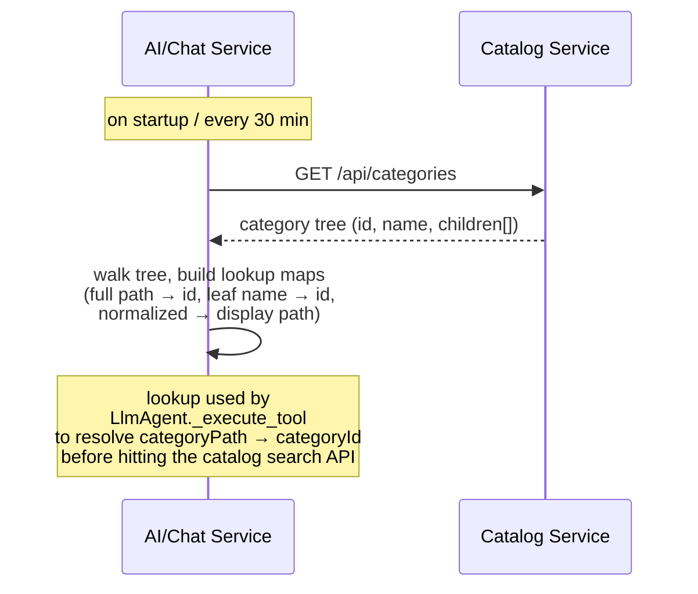

# Sequence Diagram — Category Cache Refresh

The AI/Chat service does not index products — it does not maintain any local
copy of the catalog. Instead, it keeps a lightweight in-memory cache of the
platform's **category tree**, which is used to resolve the `categoryPath`
string the LLM emits into the integer `categoryId` accepted by the catalog
search API.

The cache is refreshed from the catalog service on startup and periodically
thereafter.

