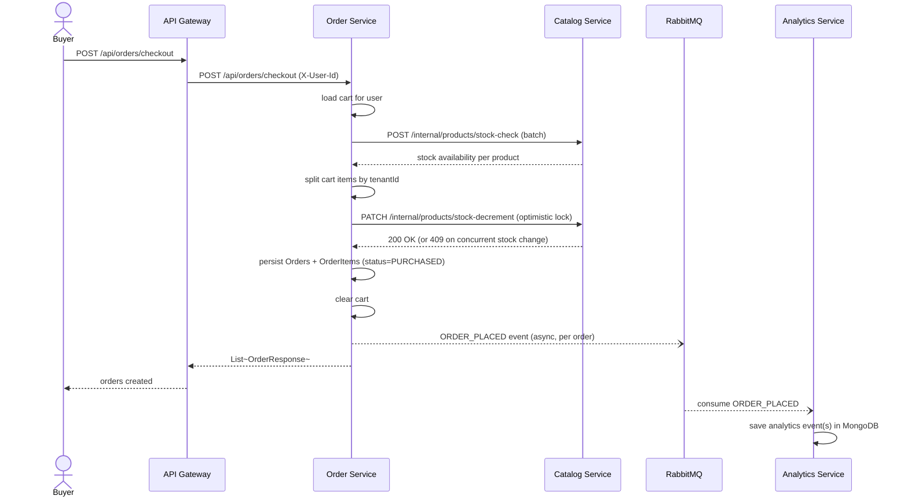

# Sequence Diagram — Checkout Flow

```mermaid
sequenceDiagram
    actor Buyer
    participant GW as API Gateway
    participant OS as Order Service
    participant CS as Catalog Service
    participant MQ as RabbitMQ
    participant AS as Analytics Service

    Buyer->>GW: POST /api/orders/checkout
    GW->>OS: POST /api/orders/checkout (X-User-Id)

    OS->>OS: load cart for user

    OS->>CS: POST /internal/products/stock-check (batch)
    CS-->>OS: stock availability per product

    OS->>OS: split cart items by tenantId

    OS->>CS: PATCH /internal/products/stock-decrement (optimistic lock)
    CS-->>OS: 200 OK (or 409 on concurrent stock change)

    OS->>OS: persist Orders + OrderItems (status=PURCHASED)
    OS->>OS: clear cart

    OS--)MQ: ORDER_PLACED event (async, per order)
    OS-->>GW: List~OrderResponse~
    GW-->>Buyer: orders created

    MQ--)AS: consume ORDER_PLACED
    AS->>AS: save analytics event(s) in MongoDB
```
