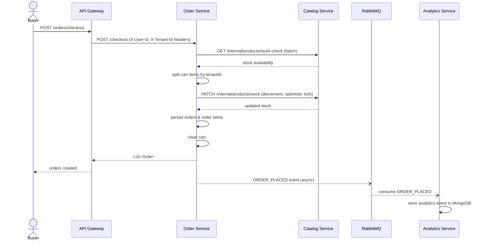

# Sequence Diagram — Checkout Flow

```mermaid
sequenceDiagram
    actor Buyer
    participant GW as API Gateway
    participant OS as Order Service
    participant CS as Catalog Service
    participant MQ as RabbitMQ
    participant AS as Analytics Service

    Buyer->>GW: POST /orders/checkout
    GW->>OS: POST /checkout (X-User-Id, X-Tenant-Id headers)

    OS->>CS: GET /internal/products/stock-check (batch)
    CS-->>OS: stock availability

    OS->>OS: split cart items by tenantId

    OS->>CS: PATCH /internal/products/stock (decrement, optimistic lock)
    CS-->>OS: updated stock

    OS->>OS: persist orders & order items
    OS->>OS: clear cart

    OS-->>GW: List~Order~
    GW-->>Buyer: orders created

    OS--)MQ: ORDER_PLACED event (async)
    MQ--)AS: consume ORDER_PLACED
    AS->>AS: store analytics event in MongoDB
```
