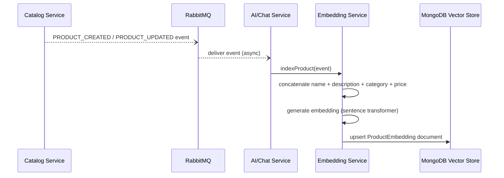

# Sequence Diagram — Product Indexing Flow

```mermaid
sequenceDiagram
    participant CS as Catalog Service
    participant MQ as RabbitMQ
    participant AI as AI/Chat Service
    participant ES as Embedding Service
    participant VS as MongoDB Vector Store

    CS--)MQ: PRODUCT_CREATED / PRODUCT_UPDATED event
    MQ--)AI: deliver event (async)

    AI->>ES: indexProduct(event)
    ES->>ES: concatenate name + description + category + price
    ES->>ES: generate embedding (sentence transformer)
    ES->>VS: upsert ProductEmbedding document
```
