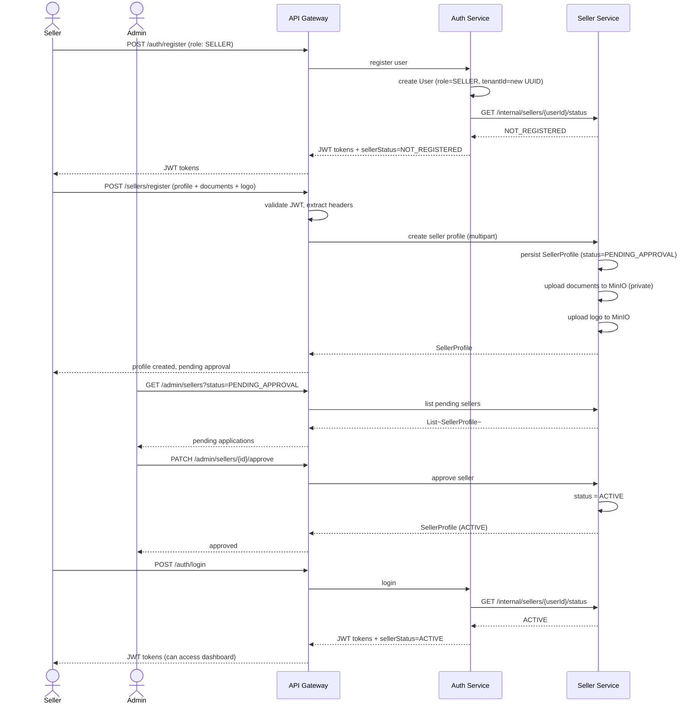

# Sequence Diagram — Seller Registration & Approval

```mermaid
sequenceDiagram
    actor Seller
    actor Admin
    participant GW as API Gateway
    participant AS as Auth Service
    participant SS as Seller Service

    Seller->>GW: POST /auth/register (role: SELLER)
    GW->>AS: register user
    AS->>AS: create User (role=SELLER, tenantId=new UUID)
    AS->>SS: GET /internal/sellers/{userId}/status
    SS-->>AS: NOT_REGISTERED
    AS-->>GW: JWT tokens + sellerStatus=NOT_REGISTERED
    GW-->>Seller: JWT tokens

    Seller->>GW: POST /sellers/register (profile + documents + logo)
    GW->>GW: validate JWT, extract headers
    GW->>SS: create seller profile (multipart)
    SS->>SS: persist SellerProfile (status=PENDING_APPROVAL)
    SS->>SS: upload documents to MinIO (private)
    SS->>SS: upload logo to MinIO
    SS-->>GW: SellerProfile
    GW-->>Seller: profile created, pending approval

    Admin->>GW: GET /admin/sellers?status=PENDING_APPROVAL
    GW->>SS: list pending sellers
    SS-->>GW: List~SellerProfile~
    GW-->>Admin: pending applications

    Admin->>GW: PATCH /admin/sellers/{id}/approve
    GW->>SS: approve seller
    SS->>SS: status = ACTIVE
    SS-->>GW: SellerProfile (ACTIVE)
    GW-->>Admin: approved

    Seller->>GW: POST /auth/login
    GW->>AS: login
    AS->>SS: GET /internal/sellers/{userId}/status
    SS-->>AS: ACTIVE
    AS-->>GW: JWT tokens + sellerStatus=ACTIVE
    GW-->>Seller: JWT tokens (can access dashboard)
```
