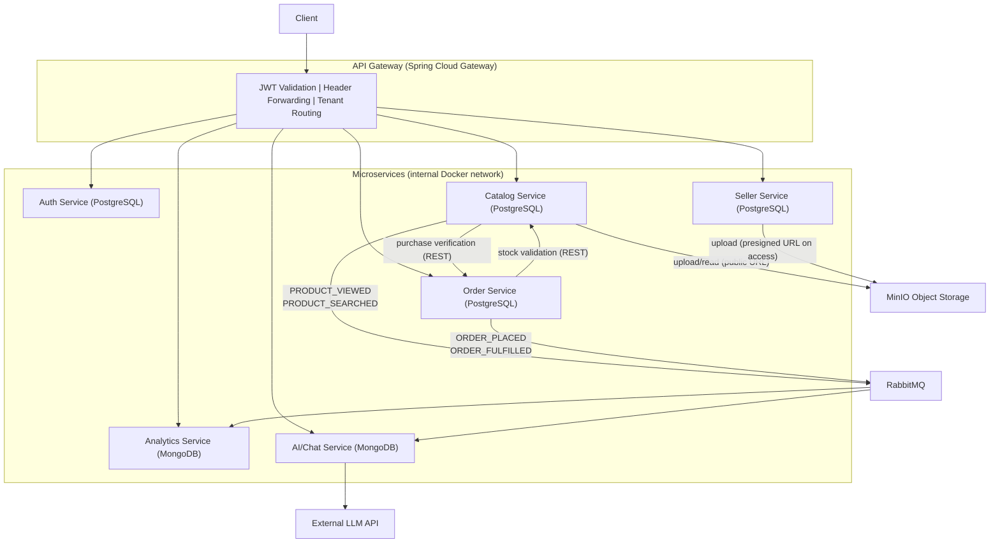

# System Architecture

```mermaid
graph TD
    Client

    subgraph Gateway["API Gateway (Spring Cloud Gateway)"]
        GW["JWT Validation | Header Forwarding | Tenant Routing"]
    end

    subgraph Services["Microservices (internal Docker network)"]
        Auth["Auth Service (PostgreSQL)"]
        Catalog["Catalog Service (PostgreSQL)"]
        Order["Order Service (PostgreSQL)"]
        Seller["Seller Service (PostgreSQL)"]
        Analytics["Analytics Service (MongoDB)"]
        AI["AI/Chat Service (MongoDB)"]
    end

    MQ["RabbitMQ"]
    LLM["External LLM API"]
    MinIO["MinIO Object Storage"]

    Client --> GW
    GW --> Auth
    GW --> Catalog
    GW --> Order
    GW --> Seller
    GW --> Analytics
    GW --> AI

    Catalog -- "PRODUCT_VIEWED\nPRODUCT_SEARCHED" --> MQ
    Order -- "ORDER_PLACED\nORDER_FULFILLED" --> MQ

    MQ --> Analytics
    MQ --> AI

    Order -- "stock validation (REST)" --> Catalog
    Catalog -- "purchase verification (REST)" --> Order

    AI --> LLM
    Catalog -- "upload/read (public URL)" --> MinIO
    Seller -- "upload (presigned URL on access)" --> MinIO
```
