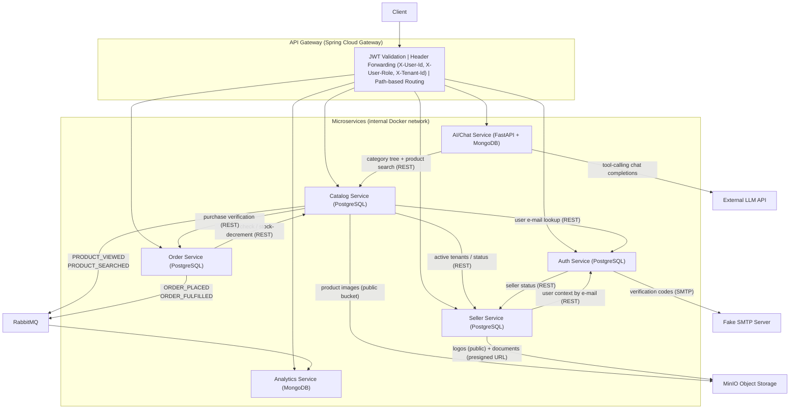

# System Architecture

```mermaid
graph TD
    Client

    subgraph Gateway["API Gateway (Spring Cloud Gateway)"]
        GW["JWT Validation | Header Forwarding (X-User-Id, X-User-Role, X-Tenant-Id) | Path-based Routing"]
    end

    subgraph Services["Microservices (internal Docker network)"]
        Auth["Auth Service (PostgreSQL)"]
        Catalog["Catalog Service (PostgreSQL)"]
        Order["Order Service (PostgreSQL)"]
        Seller["Seller Service (PostgreSQL)"]
        Analytics["Analytics Service (MongoDB)"]
        AI["AI/Chat Service (FastAPI + MongoDB)"]
    end

    MQ["RabbitMQ"]
    LLM["External LLM API"]
    MinIO["MinIO Object Storage"]
    SMTP["Fake SMTP Server"]

    Client --> GW
    GW --> Auth
    GW --> Catalog
    GW --> Order
    GW --> Seller
    GW --> Analytics
    GW --> AI

    Catalog -- "PRODUCT_VIEWED\nPRODUCT_SEARCHED" --> MQ
    Order -- "ORDER_PLACED\nORDER_FULFILLED" --> MQ
    MQ --> Analytics

    Order -- "stock-check / stock-decrement (REST)" --> Catalog
    Catalog -- "purchase verification (REST)" --> Order
    Catalog -- "user e-mail lookup (REST)" --> Auth
    Catalog -- "active tenants / status (REST)" --> Seller
    Auth -- "seller status (REST)" --> Seller
    Seller -- "user context by e-mail (REST)" --> Auth
    Auth -- "verification codes (SMTP)" --> SMTP

    AI -- "category tree + product search (REST)" --> Catalog
    AI -- "tool-calling chat completions" --> LLM

    Catalog -- "product images (public bucket)" --> MinIO
    Seller -- "logos (public) + documents (presigned URL)" --> MinIO
```
